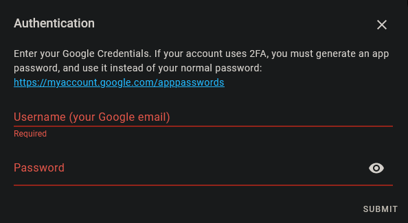
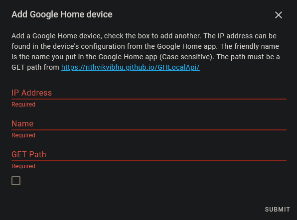

# Google Home for Home Assistant

# Installation

First, install the required dependencies, so you will have fewer problems when installing into Home Assistant. In my
case, the command is as follows, but may vary for your installation:

```shell
python3.8 -m pip install wheel requests==2.23.0 glocaltokens==0.1.4
```

Then, you can clone this repo in any dir you want, `~`, for example, with:

```shell
git clone https://github.com/ArnyminerZ/HomeAssistant-GoogleHome.git
```

After that, copy the `googlehome` dir inside the cloned repo to the `custom_components`
directory of your Home Assistant config path (usually `~/.homeassistant`). Do:

```shell
cp -r HomeAssistant-GoogleHome/custom_components/googlehome ~/.homeassistant/custom_components
```

Then, add the following tag to your Home Assistant's `configuration.yaml` file:

```yaml
googlehome:
```

# Configuration

Configuring your Google Home is really easy, and can be done from the UI.\
Simply go to your integrations page at Home Assistant (e.g. `192.168.1.1:8123/config/integrations`), select the *Add
Integration* button, and if you have [installed the integration](#installation)
correctly, an integration called *Google Home* should appear; select it.\
The following window should open:



You should fill the fields with your Google's username, and your password. This second one can be:

1. Your Google's Account password (if you don't have 2FA enabled)
2. An app password (if you have 2FA enabled). It can be generated from
   [Google's website](https://myaccount.google.com/apppasswords).

Now it's time to configure your device. First, access the Google Home app on your phone, and search for the desired
device, enter its configuration, and at the bottom of the page, the IP of the device should appear. Now, fill as
follows:



On `IP Address`, put the found address, on `Name`, the name you have set to your device in the Google Home app. In GET
path, choose one of the following:

- `next_alarm`: The value of the entity will be the timestamp (UNIX) of the next alarm at the device.

# Credits

This is a kind of compilation of different scripts in order to make the usage process easier. The used repositories are
as follows:

## Google Home Foyer API

Repository: https://gist.github.com/rithvikvibhu/952f83ea656c6782fbd0f1645059055d/

License:

```
MIT License

Copyright (c) 2020 Rithvik Vibhu

Permission is hereby granted, free of charge, to any person obtaining a copy
of this software and associated documentation files (the "Software"), to deal
in the Software without restriction, including without limitation the rights
to use, copy, modify, merge, publish, distribute, sublicense, and/or sell
copies of the Software, and to permit persons to whom the Software is
furnished to do so, subject to the following conditions:

The above copyright notice and this permission notice shall be included in all
copies or substantial portions of the Software.

THE SOFTWARE IS PROVIDED "AS IS", WITHOUT WARRANTY OF ANY KIND, EXPRESS OR
IMPLIED, INCLUDING BUT NOT LIMITED TO THE WARRANTIES OF MERCHANTABILITY,
FITNESS FOR A PARTICULAR PURPOSE AND NONINFRINGEMENT. IN NO EVENT SHALL THE
AUTHORS OR COPYRIGHT HOLDERS BE LIABLE FOR ANY CLAIM, DAMAGES OR OTHER
LIABILITY, WHETHER IN AN ACTION OF CONTRACT, TORT OR OTHERWISE, ARISING FROM,
OUT OF OR IN CONNECTION WITH THE SOFTWARE OR THE USE OR OTHER DEALINGS IN THE
SOFTWARE.
```

## GHLocal API

Repository: https://rithvikvibhu.github.io/GHLocalApi/

## GLocalTokens

Repository: https://github.com/leikoilja/glocaltokens